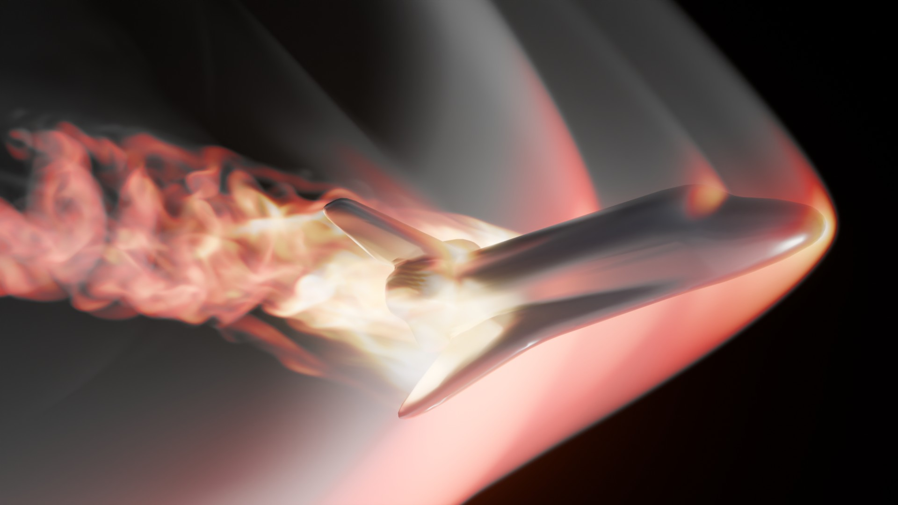

# Simple CFD

This is a lightweight computational fluid dynamics (CFD) code that solves the compressible Euler equations in 1D, 2D, or 3D using a conservative finite volume method on a Cartesian mesh. In order to achieve second-order accuracy in space and time, it uses MUSCL-Hancock reconstruction, and numerical fluxes are calculated using the HLLC approximate Riemann solver in a dimensionally split manner. Currently, only the ideal gas equation of state is implemented, but this can easily be extended. Boundaries can be transmissive, reflective, or periodic and parallelism is supported via OpenMP.


*Figure 1: Volumetic rendering of supersonic flow over a Space Shuttle showing shock waves and a turbulent wake.*

## Background
A simplification of the famous Navier-Stokes equations, the compressible Euler equations are a system of hyperbolic partial differential equations that describe the conservation of mass, momentum and total energy for inviscid fluids without thermal conduction:

$$\frac{\partial \rho}{\partial t} + \nabla \cdot (\rho \mathbf{v}) = 0 ,$$

$$\frac{\partial (\rho \mathbf{v})}{\partial t} + \nabla \cdot (\rho \mathbf{v} \otimes \mathbf{v} + I p) = 0 ,$$

$$\frac{\partial E}{\partial t} + \nabla \cdot ((E + p) \mathbf{v}) = 0 ,$$

where $\rho$ is density, $\mathbf{v}$ is velocity, $p$ is pressure, and $E = \rho e + \frac{1}{2} \rho \mathbf{v} \cdot \mathbf{v}$ is the total energy composed of an internal and a kinetic component. In order to close the system, an equation of state (EoS) is needed. In this code, the ideal gas EoS is used:

$$p = (\gamma - 1) \rho e ,$$

where $\gamma$ is the adiabatic index of the gas, which is $1.4$ for air at atmospheric conditions. Other equations of state can easily be implemented in the code in order to model fluids with more complex thermodynamics.

The equations are solved using a conservative finite volume scheme, where the domain is divided into a grid of cells. Within each cell, the change of mass, momentum, and total energy is computed over a series of small, successive time steps until the final time of the simulation has been reached. The size of these time steps is automatically determined by the code based on a stability criterion called the CFL condition. Within each time step, the flux of mass, momentum, and total energy across each cell face is calculated, and used to update the state in the cells.

## Compilation settings

There are five important settings for the code, all found in `Macros.H`. Firstly, `USE_OMP` determines whether the code is compiled with OpenMP support. Secondly, `REAL` determines which level of precision the code uses for floating point numbers (double by default, unlikely to change). `GRIDDIM` and `SPACEDIM` specify the number of spatial dimensions of the problem. Here, `GRIDDIM` is the dimensionality of the domain, while `SPACEDIM` is the dimensionality of the velocity vector. In general, they should be set to the same value, although `SPACEDIM` > `GRIDDIM` is also allowed. Finally, `USE_RIGID` determines whether the code is compiled with support for rigid bodies. After changing any of these settings, remove the executable (`simple-cfd`) and object files (`.o`) and re-compile. This can be done by running make clean and make in succession.

An additional setting is available in `Macros.H` - the `DEBUG` setting. Activating it will perform various checks as the program runs, allowing the user to more quickly find the source of errors. However, it slows the program down, so it is turned off by default.

## Running tests

Once the settings in `Macros.H` have been set, the relevant test cases for the chosen dimensionality can be run and plotted using `run_tests.bash`. Here, the desired number of OpenMP threads can also be set. Note that two files are created to store the results from each run: one `.txt` file and one `.dat` file. The `.txt` (header) file contains metadata in human-readable format (number of steps taken, final time, domain extents, resolution, number of variables), as well as the name of the second file: a `.dat` (data) file that contains the state of the simulation in binary format. Some tests will produce two header and data file pairs: one for the actual simulation data, and one for the signed distance function (SDF) describing the rigid body present in the problem. Here, the boundary of the rigid body is taken to be the zero contour of the SDF, and negative values correspond to the inside of the rigid body. It is worth noting that the SDF is provided for one cell outside the valid domain.

## Settings files

If we have such a pair of files at our disposal, the simulation can be started from this data. For this, we need to create a settings file in the same directory with the following lines:

```
initial-header-name  
final-header-name  
final-time  
low-boundary-conditions  
high-boundary-conditions  
gamma
out-interval
[sdf-header-name]
```

Here, `initial-header-name` is the name of the header file from which the simulation starts, `final-header-name` is the name of the header file to which the simulation result will be written, `final-time` is the time until which the simulation will run. `low-boundary-conditions` and `high-boundary-conditions` are the boundary conditions on the low and high sides of the domain, each encoded by `GRIDDIM` integers (0 for transmissive, 1 for reflective, and 2 for periodic) separated by whitespaces. `gamma` is the adiabatic index to be used in the ideal gas EoS, while `out-interval` is the time interval between intermediate outputs (a value of 0.0 corresponds to no intermediate output). `sdf-header-name` is an optional argument, which will be used to define the rigid body in the problem, if provided (and compiled with `USE_RIGID`). For three-dimensional simulations, the SDF can also be computed from an STL file. To make use of this feature, `sdf-header-name` should simply refer to the STL file. Note that if a valid header and data file pair with the same name as the STL file is available, it will be prioritised.

Once a settings file is created, the simulation can be run as `./simple-cfd settings-file-name`, where `settings-file-name` is the name of the file. These settings files, the intial data, and the signed distance functions can of course be generated by a script. `shock_reflection.py` provides an example of such a script, which sets up, runs, and plots the shock reflection problem. `kelvin_helmholtz.py` is another example of setting up, running and post-processing a simulation in a single script - this time, creating a movie from it.

## Importing simulation data into Blender

For more elaborate visualisations, 3D simulation outputs can also be imported into Blender using the `simple-cfd-importer.py` script. In order to make use of this functionality, install the script as a Blender add-on (required Blender version 4.4 or later). A new panel will then become visible in the side bar of the 3D viewport (press N to show it) which allows the user to select a header file and import the associated data as a volume object. The result is stored as an OpenVDB file.

## Example results

The results of example simulations can be seen in **Figure 1**, **Figure 2** and **Figure 3**.


*Figure 2: Visualization of the Kelvin–Helmholtz instability demonstrating fluid shear between two layers.*


*Figure 3: Volumetic rendering of supersonic flow over a wing showing wingtip vortices and a shock wave on the suction side.*

## Future work

A possible improvement to the code would be averaging procedures to more accurately prescribe initial conditions for the test problems. The lack of these methods leads to start-up errors, which can, for example, be observed in the cylindrical and spherical explosions in the parts of the contact discontinuity that are perpendicular to the axes.

Furthermore, the algorithm for computing a signed distance function from an STL file is wholly unoptimised and could be improved in order to start simulations with complex shapes and high resolution more quickly.
